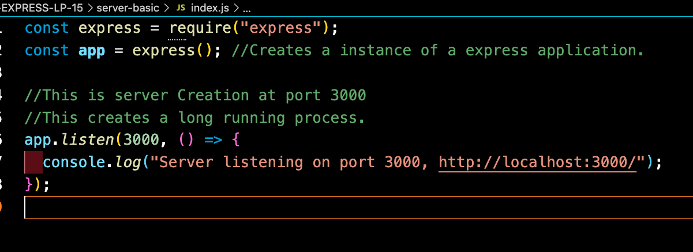
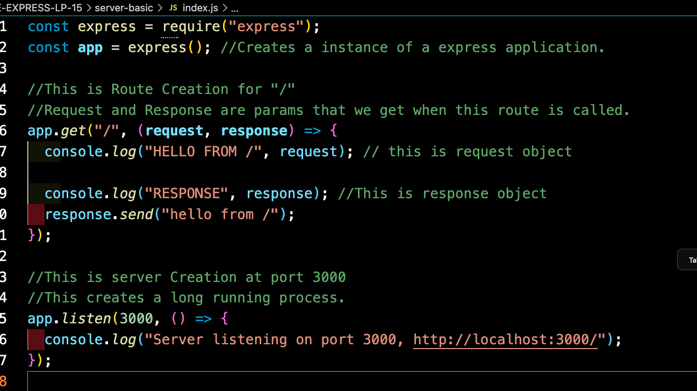

1. Create a folder -> `mkdir myapp`
2. change folder i.e move inside the created folder -> `cd myapp`
3. create a server.js or index.js -> `touch index.js`
4. npm intialize using -> `npm init -y`
5. add express -> `npm install express`
   **\*** this will create package-lock.json and node_modules which will contain express package information.
6. create server in index.js/server.js
   
7. Run index.js/server.js -> `node index.js`
8. Create a basic GET route at "/"
   
9. Restart server again by -> `node index.js`
   **\*** Make sure to close the previous server. cause only one application canrunn on one port. if port already in use another application will not start.
