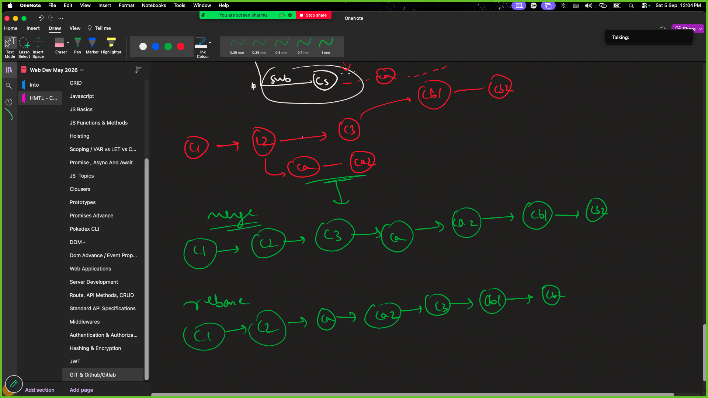

# Instructions

1. mkdir my_app
2. cd my_app
3. git init // This initializes empty git repository.
4. create a file. 'touch demo.js' // add some js code. this creates a file with untracked status.
5. git add demo.js //this will stage and start tracking file demo.js
6. git commit -m "added demo.js" //this will save the file with git and message added demo.js giving message is mandatory.

```
git add <file_name> // adds file to staged
git commit -m "<message>" // commits the staged files with a commit message
git status // this shows current state of the updated files.
git log // this shows the histroy of commits.(exit using `q`)
git remote -v //tell the place to fetch and upload code to.
git remote add <name> <url> // e.g git remote add origin https://github.com/skadoodle1201/shiny-telegram.git this tell add a place to fetch and upload with name origin.

git push <name> <branch_name> //e.g git push origin master this this push the commited code on branch master to the origin.

\*\* origin will be https://github.com/skadoodle1201/shiny-telegram.git as we have added using remote.

git branch //show the current branch you are at.
git checkout -b <branch_name> // creates a new branch with the provided branch name

git checkout <branch_name> // change to an existing branch

git merge <branch_name> // eg git merge test merge the code from the branch to your current branch. i.e merge code from test branch in master assuming current branch is master

git rebase <branch_name> // fucntions the same way merge works but changes the hisotry

```

Rebase vs merge

